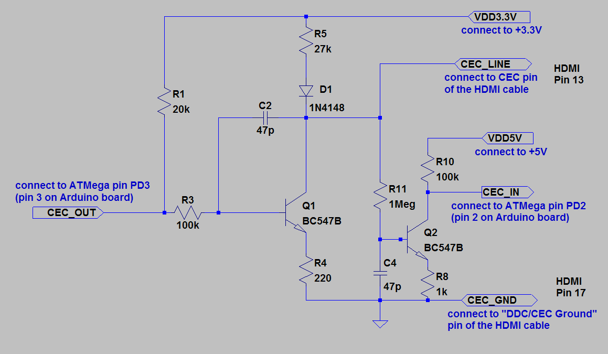

# ArdCEC

## Arduino CEC Implementation

Tested with Arduino Uno and Samsung FX2490HD.

## Improvements, Fixes and Changes

- Implemented source parameter on many transmitting functions (all "report" functions)
- Implemented Menu Request { 0x8D; 0x02 }
- Implemented Menu Activated { 0x8E, 0x00 }
- Implemented Power State handler to prevent problems with other devices using CEC.
- Changed device type from CDT_PLAYBACK_DEVICE to CDT_RECORDING_DEVICE. [*This enables some more buttons on my Samsung TV; Anyway this seems to broke OSDName reading.*]
- Created an Add-on to control Kodi Media Center (see below).

## Kodi Add-On
See here: https://github.com/marbink/ArdCEC-Kodi-Addon

## Todo
- Fix OSDName. [*Sometimes it transmits SD:01:48:54:50:43 (S = Source, D = Destination), the problem is the opcode (0x01). It should be 0x47*]
- Implement something to pass data to Arduino from PC to set some variables. (Ex: OSDName)

## Schematic
3.3V, 5V, CEC_IN, CEC_OUT and GND are connected to Arduino's pins.

CEC_LINE and CEC_GND are connected rispectively to pins 13 and 17.

Someone got it working replacing BC547B with 2N3904. It will **not** work if you replace them with 2N2222.

For HDMI connectors, someone cutted a cable. I preferred to buy a female-female adapter for some euros.

## Credits and Sources
- floe (https://github.com/floe/CEC/)
- Original code at: https://code.google.com/archive/p/cec-arduino/ (c) Phil Burr and Andrew N. Carr
- Arduino forum (http://forum.arduino.cc/index.php?topic=22327.0)
